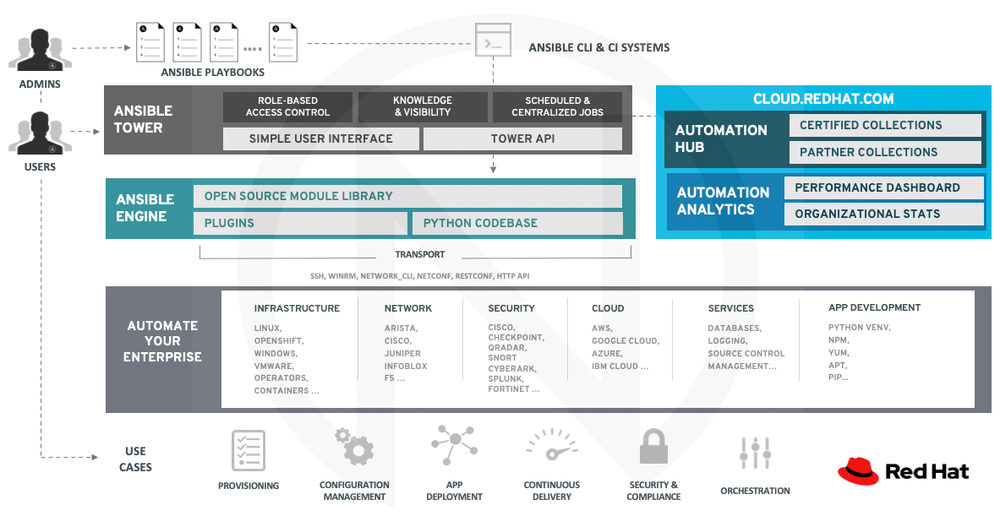
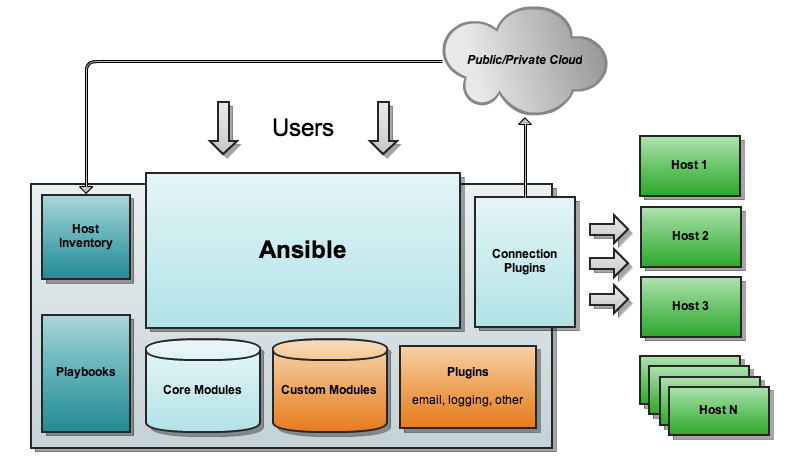

<!-- backgroundImage: "linear-gradient(to right bottom, #e6e6dc, #96968c)" -->


# Ansible

---
# Agenda
- Why Ansible
- What is Ansible
- Desired states & idempotency
- How Ansible works
- Ansible Inventory
- Ansible Ad-Hoc
- Ansible Playbook and YAML
- Validate Playbooks and troubleshooting
- Ansible Roles and reuse the code (Ansible Galaxy)

---

## Why Ansible


- Orchestration
- Configuration management
- Provisioning
- Deploy
- Remote API call



---

## What is Ansible
Ansible is **connecting** to the nodes from list named **Ansible Inventory** and sending to them programs called **Ansible Modules**, which are by the nature are  **resource model** operating **desired states**

---

## Ansible advantages : Repetable
- desired state
- idempotency

---

## What is desired state?
Most Ansible modules check whether the desired final state has already been achieved, and exit without performing any actions if that state has been achieved, so that repeating the task does not change the final state. Modules that behave this way are often called ‘idempotent.’ Whether you run a playbook once, or multiple times, the outcome should be the same

However, not all modules behave this way

---
```yaml
---
- hosts: all
  tasks:
   - name: create the file
     file:
       path: /tmp/file
       state: touch
   - name: add line in file
     lineinfile:
       path: /tmp/file
       line: 'i am a line'
       state: present
   - name: lets try another time to add the same line in file
     lineinfile:
       path: /tmp/file
       line: 'i am a line'
       state: present
   - name: lets remove line manually
     raw: "> /tmp/file"
   - name: ensure that line is in place
     lineinfile:
       path: /tmp/file
       line: 'i am a line'
       state: present
```
ansible-playbook -i inventory.ini labs/idempotency.yml -v

---
## Ansible documentation


```bash
## Ansible related documentation
ansible-doc -l > /tmp/ansible.txt

grep mysql_user /tmp/ansible.txt 
mysql_user Adds or removes a user from a MySQL database. 
proxysql_mysql_users Adds or removes mysql users from proxysql admin interface. 

ansible-doc mysql_user
```
[List of Ansible modules](https://docs.ansible.com/ansible/2.9/modules/list_of_all_modules.html)


---
## How Ansible works
Ansible is **connecting** to the nodes from list named **Ansible Inventory** and sending to them programs called **Ansible Modules**, which are by the nature are  **resource model** operating **desired states*


---

## How Ansible works: advantages
### Simple
- Text (formatted)
- VCS ready
- No agent needed
- Strong community (Ansible Galaxy)

---

### Flexible
- long list of built-in modules
- able to use remote REST API
- ready to use modules to Cloud API
- can write your own module (even using bash)


---
## How Ansible works
## What is needed to run Ansible
- Python
- Ansible
- Ability to deliver modules to hosts from inventory

---

### What are connection options
```
ansible-doc -t connection -l
buildah      Interact with an existing buildah container
chroot       Interact with local chroot
docker       Run tasks in docker containers
funcd        Use funcd to connect to target
httpapi      Use httpapi to run command on network appliances
iocage       Run tasks in iocage jails
jail         Run tasks in jails
kubectl      Execute tasks in pods running on Kubernetes
libvirt_lxc  Run tasks in lxc containers via libvirt
local        execute on controller
lxc          Run tasks in lxc containers via lxc python library
lxd          Run tasks in lxc containers via lxc CLI
napalm       Provides persistent connection using NAPALM
netconf      Provides a persistent connection using the netconf protocol
network_cli  Use network_cli to run command on network appliances
oc           Execute tasks in pods running on OpenShift
paramiko_ssh Run tasks via python ssh (paramiko)
persistent   Use a persistent unix socket for connection
podman       Interact with an existing podman container
psrp         Run tasks over Microsoft PowerShell Remoting Protocol
qubes        Interact with an existing QubesOS AppVM
saltstack    Allow ansible to piggyback on salt minions
ssh          connect via ssh client binary
vmware_tools Execute tasks inside a VM via VMware Tools
winrm        Run tasks over Microsoft's WinRM
zone         Run tasks in a zone instance
```

---

## Inventory 

```
---
[webservers] <--- groups
www1.example.com
www2.example.com

[dbservers]
db0.example.com <--- hosts
db1.example.com
```
ansible-inventory [options] [host|group]

- Inventory file format may vary (ini,yaml,toml or json)
- Inventory can be generated dynamically 
- You may use multiple inventories (-i dc1 -i dc2)
https://docs.ansible.com/ansible/latest/user_guide/intro_inventory.html

---

## Ansible Ad-Hoc: Direct module calling

Run in a lab >
```
ansible all -m ping -i inventory.ini
```
all here is a pattern

```
ansible server0* -i inventory.ini -a "date"
```

---

## Ansible Ad-Hoc: Ansible Console
```json
ansible-console -i inventory.ini all
Welcome to the ansible console.
Type help or ? to list commands.

user@all (2)[f:5]$ ping
server01 | SUCCESS => {
"ansible_facts": {
"discovered_interpreter_python": "/usr/bin/python"
}, 
"changed": false, 
"ping": "pong"
}
server02 | SUCCESS => {
"ansible_facts": {
"discovered_interpreter_python": "/usr/bin/python"
}, 
"changed": false, 
"ping": "pong"
}
```


---
## Ansible Playbooks as an automation approach

Ansible Playbooks offer a repeatable, re-usable, simple configuration management and multi-machine deployment system, one that is well suited to deploying complex applications. If you need to execute a task with Ansible more than once, write a playbook and put it under source control

---

## Ansible Playbooks can

- declare configurations
- orchestrate steps on multiple sets of machines, in a defined order
- launch tasks synchronously or asynchronously

[Read more how to handle async tasks](https://docs.ansible.com/ansible/latest/user_guide/playbooks_async.html)

---

By default, Ansible executes each task in order, one at a time, against all machines matched by the host pattern (pre-defined in **Inventory**). Each task executes a module with specific arguments. When a task has executed on all target machines, Ansible moves on to the next task. 

This behaviour may be changed by choosing strategies

[Read more about strategies](https://docs.ansible.com/ansible/latest/user_guide/playbooks_strategies.html)

---
## MVP: Minimum Viable Playbook
- targets
- at least one task to execute

```
---
- hosts: all
  gather_facts: false
  tasks:
    - ping:
```
Run in a lab
> ansible-playbook -i inventory.ini labs/helloworld.yml

---
## Playbooks are expressed in YAML format
- A dictionary is represented in a simple key: value form
```
users:
  name: kevit
```

- Values can span multiple lines using | or >
```
include_newlines: |
            exactly as you see
            will appear in the key
```

- Ansible uses __"{{ var }}"__ for variables. 

Learn more about jinja2
> lynx /usr/share/doc/python3-jinja2/html/templates.html

--- 
## Ansible variables
Ansible uses variables to manage differences between systems
You can define these variables 
 - in your playbooks
 - in your inventory
 - in roles
 - at the command line
 - at runtime via register


---
## Typical playbook directory structure

```
cat inventory.ini
---
[webservers] <--- groups
www1.example.com
www2.example.com

[dbservers]
db0.example.com <--- hosts
db1.example.com
```

```
group_vars/
   webservers.yml
   dbservers.yml
host_vars/
   db0.example.com.yml
   db1.example.com.yml
inventory.ini
playbook.yml
```

---
## Ansible variables: precedence
```
command line values (for example, -u my_user, these are not variables)
role defaults (defined in role/defaults/main.yml)
inventory file or script group vars 
inventory group_vars/all
playbook group_vars/all
inventory group_vars/* 
playbook group_vars/* 
inventory file or script host vars 
inventory host_vars/*
playbook host_vars/*
host facts / cached set_facts
play vars
play vars_prompt
play vars_files
role vars (defined in role/vars/main.yml)
block vars (only for tasks in block)
task vars (only for the task)
include_vars
set_facts / registered vars
role (and include_role) params
include params
extra vars (for example, -e "user=my_user")(always win precedence)
```
---

foo_port is a good name for variable but foo-port, 5foo or foo.port is bad (python!)

Why foo.port is bad?

```
foo:
  port: value
```

[Read more about variables](https://docs.ansible.com/ansible/latest/user_guide/playbooks_variables.html)

Lab time!
> ansible-playbook -i inventory.ini labs/required_vars.yml -e var1=true -e var2=false

---
## Filling out variables and transform them
[Lookups](https://docs.ansible.com/ansible/latest/user_guide/playbooks_lookups.html)
```
vars:
  motd_value: "{{ lookup('file', '/etc/motd') }}"
tasks:
  - debug:
      msg: "motd value is {{ motd_value }}"
```
[Filters](https://docs.ansible.com/ansible/latest/user_guide/playbooks_filters.html)
```
{{ 'secretpassword' | password_hash('blowfish', '1234567890123456789012', ident='2b') }}
```


---
## How to write a good Playbooks?
- Use VCS
- Remember about Idempotency
- Be Imperative! ()
- Fail properly (fail: or assert:)

```
- name: "Unknown error"
  fail:
    msg: "Something happened"
  when: result.stdout == "Error"
```
Practice!
> VARIABLE=Test ansible-playbook -i inventory.ini labs/environ_test.yml -e env_variable=VARIABLE -e env_value=Test


---
## Name tasks right way
```
- name: "nginx: 005 - create directories"

ansible-playbook -i inventory.ini playbook.yml --start-at-task "nginx: 005 - create directories"
```

## Use different verbosity levels
```
- debug:
  msg: "always"
- debug:
  msg: "only at -vv"
  verbosity: 2
```


--- 

## Validate
- yamllint helps to check yaml syntax
> yamllint labs/valid_yaml_invalid_ansible.yml
> yamllint labs/invalid_yaml.yml
- The ansible-playbook command offers several options for verification
 --check, --diff, --list-hosts, --list-tasks, and --syntax-check. 
Lab time!
> ansible-playbook -i inventory.ini labs/valid_yaml_invalid_ansible.yml --check
> ansible-playbook -i inventory.ini labs/check.yml
> ansible-playbook -i inventory.ini labs/check.yml --check

---

- ansible-lint helps to check ansible-specific issues
>  ansible-lint labs/idempotency.yml
- ansible-playbook -i inventory.ini plabs/idempotency.yml --step
- internal debugger ANSIBLE_STRATEGY=debug

https://github.com/ansible/test-playbooks

---
## Troubleshooting

Will show Ansible version
```
ansible --version
```
Will show config and diff from default settings
```ini
ansible-config view 
[defaults]
remote_user=user
host_key_checking=False
private_key_file=key
```
```
ansible-config dump --only-changed
DEFAULT_PRIVATE_KEY_FILE(/root/ansible.cfg) = /root/key
DEFAULT_REMOTE_USER(/root/ansible.cfg) = user
HOST_KEY_CHECKING(env: ANSIBLE_HOST_KEY_CHECKING) = False
```
---


Will show all hosts (or hosts by pattern)
```
ansible -i inventory.ini --list-hosts all
```
---
## Troubleshooting: Privilege escalation

> ansible-playbook -i inventory.ini labs/become.yml -v
> ansible-playbook -i inventory.ini labs/become.yml -b -v

https://docs.ansible.com/ansible/latest/user_guide/become.html

---

## Ansible Roles Reuse a code right way
- Ansible Roles helps to reuse your code
- Roles let you automatically load related vars, files, tasks, handlers as a part of playbook
- After you group your content in roles, you can easily reuse them and share them with other users.

---

## Typical role skeleton
```
ansible-galaxy init examlpe_role
role_name/
    README.md
    defaults/
        main.yml
    files/
    handlers/
        main.yml
    meta/
        main.yml
    templates/
    vars/
        main.yml
```

---

## Typical role skeleton: meaning
```
tasks/main.yml - the main list of tasks that the role executes.
handlers/main.yml - handlers, which may be used within or outside this role.
defaults/main.yml - default variables for the role
vars/main.yml - other variables for the role
files/ - files that the role deploys.
templates/ - templates that the role deploys.
meta/main.yml - metadata for the role, including role dependencies.
```

---
### How to call the role

```
---
- hosts: all
  roles:
    - example_role
```
```
- hosts: all
  tasks: 
    - name: Include the example role
      include_role:
        name: example_role
```
---
## Using Ansible Galaxy
```
ansible-galaxy install -r requirements.yml

cat requirements.yml
# Role on galaxy
- your.rolename
# Public role on github
- name: role-public
  src: https://github.com/user/role-public.git
```
---

Thank you! 
Questions?


